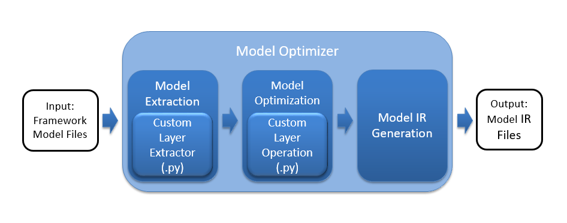

# People Counter application

A people counter app optimized to work with very little latency to work
on edge. The model is optimized with Intel [Open Vino toolkit](https://software.intel.com/content/www/us/en/develop/tools/openvino-toolkit.html). This repo also demonstrates how inference could take 
place with a video.

## Explaining Custom Layers

Let us first see a worksflow of how Open Vino toolkit converts models 
for us. First the model optimizer searches the list of known layers for 
each layer in the input model. The inference engine thenn loads the  
layers from the input model IR files into the specified device plugin, 
which will search a list of known layer implementations for the device. 
If your model architecure contains layer or layers that are not in the 
list of known layers for the device, the Inference Engine considers the 
layer to be unsupported and reports an error. To see the layers that 
are supported by each device plugin for the Inference Engine, refer to 
the [Supported Devices documentation](https://docs.openvinotoolkit.org/2019_R1.1/_docs_IE_DG_supported_plugins_Supported_Devices.html).

### Custom Layers implementation

When implementing a custom layer for your pre-trained model in the
Open Vino toolkit, you will need to add extensions to both the Model 
Optimizer and the Inference Engine.

#### Model optimizer

The following figure shows the basic processing steps for the Model Optimizer highlighting the two necessary custom layer extensions, the Custom Layer Extractor and the Custom Layer Operation.



<details>
  <summary>Source</summary>
  https://docs.openvinotoolkit.org/
</details>

The Model Optimizer first extracts information from the input model which includes the topology of the model layers along with parameters, input and output format, etc., for each layer. The model is then optimized from the various known characteristics of the layers, interconnects, and data flow which partly comes from the layer operation providing details including the shape of the output for each layer. Finally, the optimized model is output to the model IR files needed by the Inference Engine to run the model.

There are majorly two custom layer extensions required-

1. Custom Layer Extractor

Responsible for identifying the custom layer operation and extracting the parameters for each instance of the custom layer. The layer parameters are stored per instance and used by the layer operation before finally appearing in the output IR. Typically the input layer parameters are unchanged, which is the case covered by this tutorial.

2. Custom Layer Operation

Responsible for specifying the attributes that are supported by the custom layer and computing the output shape for each instance of the custom layer from its parameters. The `--mo-op` command-line argument shown in the examples below generates a custom layer operation for the Model Optimizer.

#### Inference Engine

The following figure shows the basic flow for the Inference Engine highlighting two custom layer extensions for the CPU and GPU Plugins, the Custom Layer CPU extension and the Custom Layer GPU Extension.


<details>
  <summary>Source</summary>
  https://docs.openvinotoolkit.org/
</details>

Each device plugin includes a library of optimized implementations to execute known layer operations which must be extended to execute a custom layer. The custom layer extension is implemented according to the target device:

1. Custom Layer CPU Extension

A compiled shared library (`.so` or `.dll` binary) needed by the CPU Plugin for executing the custom layer on the CPU.

2. Custom Layer GPU Extension

OpenCL source code (`.cl`) for the custom layer kernel that will be compiled to execute on the GPU along with a layer description file (`.xml`) needed by the GPU Plugin for the custom layer kernel.

#### Using the model extension generator

The Model Extension Generator tool generates template source code files for each of the extensions needed by the Model Optimizer and the Inference Engine.

The script for this is available here-  `/opt/intel/openvino/deployment_tools/tools/extension_generator/extgen.py`

You could use this script in the following manner:

```
usage: You can use any combination of the following arguments:

Arguments to configure extension generation in the interactive mode:

optional arguments:
  -h, --help            show this help message and exit
  --mo-caffe-ext        generate a Model Optimizer Caffe* extractor
  --mo-mxnet-ext        generate a Model Optimizer MXNet* extractor
  --mo-tf-ext           generate a Model Optimizer TensorFlow* extractor
  --mo-op               generate a Model Optimizer operation
  --ie-cpu-ext          generate an Inference Engine CPU extension
  --ie-gpu-ext          generate an Inference Engine GPU extension
  --output_dir OUTPUT_DIR
                        set an output directory. If not specified, the current
                        directory is used by default.
```

### Reasons for handling custom layers

In industry problems it becomes very important to be able to convert custom layers as your teams might be developing something new or researching on something and your application to work smoothly you would need to know how you could have support for custom layers.

Another common use case would be when using `lambda` layers. These layers are where you could add an arbitary peice of code to your model implementation. You would need to have support for these kind of layers and custom layers is your way 

## Comparing Model Performance

I ended up using a model from Intel OpenVino Model Zoo due to poor performance of converted models. I have majorly stressed on model accuracy and inference time, I have included model size as a secondary metric. I have stated the models I experimented with. For more information take a look at Model Research.

### Model size

| |SSD MobileNet V2|SSD Inception V2|SSD Coco MobileNet V1|
|---|---|---|---|---|
|Before Conversion|67 MB|98 MB|28 MB|
|After Conversion|65 MB|96 MB|26 MB|

### Inference Time

| |SSD MobileNet V2|SSD Inception V2|SSD Coco MobileNet V1|
|---|---|---|---|---|
|Before Conversion|50 ms|150 ms|55 ms|
|After Conversion|60 ms|155 ms|60 ms|

## Assess Model Use Cases

I beleive a similar application could be widely useful, here are a few of which I feel have a great impact

1. Make Business detection in stores

With reliable people counting application in stores could help businesses make effective deisions and help in-

* Compare performance across different areas
* Calculate people patterns
* Optimise product placing strategies
* Optimize staff placing

2. Queue managemnet techniques

We all might have experienced leaving a store due to high amount of queues, a similar application could help in that.

* Increase customer retention
* Calculate percentage of people who leave stores due to long queues
* Optimize staffs
* Help in right placement of billing desks

3. Space management

This application could also help in making best use of spaces in public areas and also aid in placement of furniture and/ or artifacts.

* Know the area in a space where people crowd the most
* Discover when stores generate the most traffic which might open sale opurtunities

4. In Airports

Airports are one of the busiest places and with so much data with an application like this, some wonderful insights could be derived.

* Identify which shops perform well
* Make sure each shop is placed at the optimal position
* Manage queues

5. As a security system

This application could also be used in security systems, The system could identify if a person has broken in a shop and in the case capture a photo or send alerts. This could be an automated and effective solution to thefts.

## Assess Effects on End User Needs

Lighting, model accuracy, and camera focal length/image size have different effects on a deployed edge model. The potential effects of each of these are as follows:

* In case of  poor lighting model's accuracy may fail dramatically or even completely drop close to zero. However, this can be mitigated with good hardware that can process the images from poorly lit regions before passing it to the model.

* Natural decrease in model accuracy during conversion or other stages may make the model unusable if the doesn't perform the required task such as detecting risk of crimes as mentioned above in use-cases. A effectuve solution to this would be to put the model into validation mode for an hour or so. During this time the various devices could perform federated learning to give better performance. This might drastically provide a better performance.

* Distorted input from camera due to change in focal length and/or image size will affect the model because the model may fail to make sense of the input and the distored input may not be detected properly by the model. An approach to solve this would be to use some augmnted images while training models and specifying the threshold skews, this could be a potential solution. However, the ranges would need to be selected correctly or it could lead to a loss of accuracy.

## Model Research

In investigating potential people counter models, I tried each of the following three models:

- Model 1: SSD Mobilenet
  - [Model Source](https://github.com/tensorflow/models/blob/master/research/object_detection/g3doc/detection_model_zoo.md)
  - I converted the model to an Intermediate Representation with the following arguments
  
```
python mo_tf.py --input_model frozen_inference_graph.pb --tensorflow_object_detection_api_pipeline_config pipeline.config --reverse_input_channels --tensorflow_use_custom_operations_config extensions/front/tf/ssd_v2_support.json
```

  - The model was insufficient for the app because it wasn't pretty accurate while doing inference. Here's an image showing mis classification of the model:


  - I tried to improve the model for the app by using some transfer learning techniques, I tried to retrain few of the model layers with some additional data but that did not work too well for this use case.
  
- Model 2: SSD Inception V2]
  - [Model Source](http://download.tensorflow.org/models/object_detection/ssd_inception_v2_coco_2018_01_28.tar.gz)
  - I converted the model to an Intermediate Representation with the following arguments
  
```
python mo_tf.py --input_model frozen_inference_graph.pb --tensorflow_object_detection_api_pipeline_config pipeline.config --reverse_input_channels --tensorflow_use_custom_operations_config extensions/front/tf/ssd_v2_support.json
```
  
  - The model was insufficient for the app because it had pretty high latency in making predictions ~155 ms whereas the model I now use just takes ~40 ms. It made accurate predictions but due to a very huge tradeoff in inference time, the model could not be used.
  - I tried to improve the model for the app by reducing the precision of weights, however this had a very huge impact on the accuracy.

- Model 3: SSD Coco MobileNet V1
  - [Model Source](http://download.tensorflow.org/models/object_detection/ssd_inception_v2_coco_2018_01_28.tar.gz)
  - I converted the model to an Intermediate Representation with the following arguments

```
python mo_tf.py --input_model frozen_inference_graph.pb --tensorflow_object_detection_api_pipeline_config pipeline.config --reverse_input_channels --tensorflow_use_custom_operations_config extensions/front/tf/ssd_v2_support.json
```

  - The model was insufficient for the app because it had a very low inference accuracy. I particularly observed a trend that it was unable to identify people with their back facing towards the camera making this model unusable.

## The Model

As having explained above the issues I faced with some other models so I ended up using models from the OpenVino Model zoo, I particularly found two models which seemed best for the job
 
- [person-detection-retail-0002](https://docs.openvinotoolkit.org/latest/person-detection-retail-0002.html)
- [person-detection-retail-0013](https://docs.openvinotoolkit.org/latest/_models_intel_person_detection_retail_0013_description_person_detection_retail_0013.html)

These models are in fact based on the MobileNet model, the MobileNet model performed well for me considering latency and size apart of few inference errors. These models have fixed that error.

I found that [person-detection-retail-0013](https://docs.openvinotoolkit.org/latest/_models_intel_person_detection_retail_0013_description_person_detection_retail_0013.html) had a higher overall accuracy and ended up using it.

### Downloading model

Download all the pre-requisite libraries and source the openvino installation using the following commands:

```sh
pip install requests pyyaml -t /usr/local/lib/python3.5/dist-packages && clear && 
source /opt/intel/openvino/bin/setupvars.sh -pyver 3.5
```

Navigate to the directory containing the Model Downloader:

```sh
cd /opt/intel/openvino/deployment_tools/open_model_zoo/tools/downloader
```

Within there, you'll notice a `downloader.py` file, and can use the `-h` argument with it to see available arguments, `--name` for model name, and `--precisions`, used when only certain precisions are desired, are the important arguments. Use the following command to download the model

```sh
sudo ./downloader.py --name person-detection-retail-0013 --precisions FP16 -o /home/workspace
```

## Performing Inference

Open a new terminal

Execute the following commands:

```sh
  cd webservice/server
  npm install
```
After installation, run:

```sh
  cd node-server
  node ./server.js
```

If succesful you should receive a message-

```sh
Mosca Server Started.
```

Open another terminal

These commands will compile the UI for you

```sh
cd webservice/ui
npm install
```

After installation, run:

```sh
npm run dev
```

If succesful you should receive a message-

```sh
webpack: Compiled successfully
```

Open another terminal and run:

This will set up the `ffmpeg` for you

```sh
sudo ffserver -f ./ffmpeg/server.conf
```

Finally execute the following command in another terminal

This peice of code specifies the testing video provided in `resources/` folder and run it on port `3004`

```sh
python main.py -i resources/Pedestrian_Detect_2_1_1.mp4 -m person-detection-retail-0013/FP32/person-detection-retail-0013.xml -l /opt/intel/openvino/deployment_tools/inference_engine/lib/intel64/libcpu_extension_sse4.so -d CPU -pt 0.6 | ffmpeg -v warning -f rawvideo -pixel_format bgr24 -video_size 768x432 -framerate 24 -i - http://0.0.0.0:3004/fac.ffm
```
